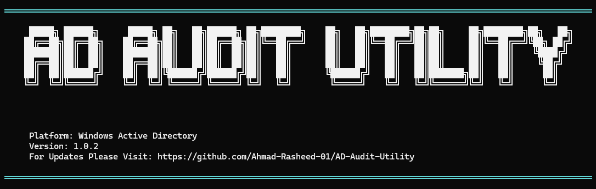

# Active Directory Security Assessment Utility

<div align="center">
  
</div>

🛡️ **A comprehensive PowerShell script for auditing Active Directory environments and identifying potential security vulnerabilities.**

[](LICENSE)
[](https://docs.microsoft.com/en-us/powershell/)
[](https://www.microsoft.com/windows/)

[🔍 Features](#-features) •
[🚀 Quick Start](#-quick-start) •
[📊 Output Reports](#-output-reports) •
[🛠️ Troubleshooting](#️-troubleshooting) •
[📄 License](#-license)


## 🔍 Features

### 🏢 **Comprehensive AD Analysis**
- **Forest & Domain Information**: Complete domain structure, trust relationships, and FSMO roles
- **Domain Controller Health**: DC diagnostics and configuration analysis
- **Organizational Units**: Complete OU structure mapping

### 🔐 **Security Policy Assessment**
- **Password Policies**: Default and fine-grained password policy evaluation
- **Account Lockout**: Security settings and lockout configurations
- **Audit Policies**: Domain controller audit policy analysis

### 👥 **Privileged Account Auditing**
- **High-Privilege Groups**: Domain Admins, Enterprise Admins, Schema Admins analysis
- **AdminCount Analysis**: Accounts with elevated privileges
- **Service Accounts**: Identification and security assessment

### 🛡️ **Advanced Security Checks**
- **Kerberos Security**: Delegation configurations and potential vulnerabilities
- **SID History**: Analysis for potential security risks
- **Inactive Accounts**: User and computer accounts with extended inactivity
- **Legacy Systems**: Outdated operating system identification

### 📋 **Group Policy Analysis**
- **GPO Inventory**: Complete Group Policy Object listing
- **GPO Backup**: Automated backup creation
- **HTML Reports**: Detailed GPO analysis in readable format

### 📊 **Organized Reporting**
- **Categorized Output**: Results organized into logical directories
- **Multiple Formats**: TXT, CSV, and HTML report generation
- **Timestamped Results**: Automatic versioning with execution timestamps

## 🚀 Quick Start

### Prerequisites

- **Windows PowerShell 5.1+** or **PowerShell Core 7+**
- **Domain-joined machine** or **RSAT tools** installed
- **Active Directory PowerShell module**
- **Administrative privileges** on the domain
- **Group Policy Management Console** (for GPO analysis)

### Installation

1. **Clone the repository**
   ```powershell
   git clone https://github.com/Ahmad-Rasheed-01/AD-Assessment-Utility.git
   cd AD-Assessment-Utility
   ```

2. **Verify PowerShell execution policy**
   ```powershell
   Get-ExecutionPolicy
   # If restricted, set to RemoteSigned (run as Administrator)
   Set-ExecutionPolicy RemoteSigned -Scope CurrentUser
   ```

3. **Import Active Directory module**
   ```powershell
   # Import Active Directory module (if not auto-loaded)
   Import-Module ActiveDirectory
   ```

4. **Run the assessment**
   ```powershell
   # Run the complete AD assessment
   .\ADScript.ps1
   
   # The script will create timestamped output directory
   # Example: AD_Assessment_20241201_143022
   # All results will be organized in categorized subdirectories
   ```

## 📁 Output Structure

The script creates a timestamped directory with organized subdirectories:

```
AD_Assessment_YYYYMMDD_HHMMSS/
├── 01_Host_and_System_Info/
│   ├── SystemInfo.txt
│   ├── HostInfo.txt
│   └── NetworkConfig.txt
├── 02_Forest_and_Domain_Info/
│   ├── ForestInfo.txt
│   ├── DomainInfo.txt
│   ├── DomainControllers.txt
│   └── TrustRelationships.txt
├── 03_Password_and_Security_Policies/
│   ├── DefaultDomainPasswordPolicy.txt
│   ├── FineGrainedPasswordPolicies.txt
│   └── AccountLockoutPolicy.txt
├── 04_Privileged_Groups_and_Accounts/
│   ├── DomainAdmins.txt
│   ├── EnterpriseAdmins.txt
│   ├── SchemaAdmins.txt
│   └── AdminCountUsers.txt
├── 05_Account_Auditing/
│   ├── InactiveUsers.txt
│   ├── InactiveComputers.txt
│   ├── ServiceAccounts.txt
│   └── UserAccountControl.txt
├── 06_Advanced_Security_Checks/
│   ├── KerberosSettings.txt
│   ├── SIDHistory.txt
│   ├── LegacyOperatingSystems.txt
│   └── UnconstrainedDelegation.txt
├── 07_Group_Policy_Auditing/
│   ├── AllGPOs.txt
│   ├── GPOBackups/
│   └── GPOReports/
└── 08_System_Time_and_Services/
    ├── SystemTime.txt
    ├── TimeConfiguration.txt
    └── CriticalServices.txt
```

## 📋 Report Types

### 🔍 **Security Assessment Reports**
- **Privileged Account Analysis**: Comprehensive review of high-privilege accounts
- **Password Policy Compliance**: Evaluation against security best practices
- **Inactive Account Detection**: Identification of stale user and computer accounts
- **Kerberos Security Review**: Analysis of delegation and authentication settings

### 📊 **Configuration Reports**
- **Domain Controller Health**: Status and configuration of all DCs
- **Group Policy Inventory**: Complete GPO documentation and backup
- **Trust Relationship Mapping**: Inter-domain and forest trust analysis
- **Service Account Audit**: Identification and security assessment

## 🛡️ Security Considerations

⚠️ **Important**: This tool handles sensitive Active Directory information. Please review our [Security Policy](SECURITY.md) for:
- Vulnerability reporting procedures
- Security best practices
- Safe usage guidelines
- Data protection requirements

## 🔧 Troubleshooting

### Common Issues

**PowerShell Execution Policy Error**
```powershell
# Solution: Set execution policy
Set-ExecutionPolicy RemoteSigned -Scope CurrentUser
```

**Active Directory Module Not Found**
```powershell
# Solution: Install RSAT tools or import module
Import-Module ActiveDirectory -Force
```

**Access Denied Errors**
- Ensure you have Domain Admin or equivalent privileges
- Verify the account has "Log on as a service" rights if needed
- Check if the machine is properly domain-joined

**GPO Analysis Failures**
- Verify Group Policy Management Console is installed
- Ensure SYSVOL access permissions
- Check network connectivity to domain controllers

## 🧪 Testing

### Lab Environment Testing

```powershell
# Test in isolated AD lab environment
# Verify script functionality before production use

# Test basic AD connectivity
Get-ADDomain
Get-ADForest

# Test with limited privileges
# Run as standard domain user to verify error handling

# Validate output directory creation
Test-Path "AD_Assessment_*"
```

### Validation Checklist

- ✅ **Module Dependencies**: Verify all required PowerShell modules are available
- ✅ **Permissions**: Test with various privilege levels
- ✅ **Output Generation**: Confirm all report files are created
- ✅ **Error Handling**: Validate graceful failure scenarios
- ✅ **Performance**: Monitor execution time in large environments

## 📈 Performance Considerations

### Environment Sizing

| Domain Size | Expected Runtime | Memory Usage |
|-------------|------------------|-------------|
| Small (< 1K users) | 2-5 minutes | < 512MB |
| Medium (1K-10K users) | 5-15 minutes | 512MB-1GB |
| Large (10K+ users) | 15-45 minutes | 1GB+ |

### Optimization Tips

- 🚀 **Scheduled Execution**: Run during off-peak hours
- 📊 **Incremental Analysis**: Focus on specific OUs for targeted assessments
- 🔄 **Parallel Processing**: Leverage PowerShell jobs for large datasets
- 💾 **Output Management**: Implement retention policies for historical reports


## 🤝 Contributing

We welcome contributions to improve the AD Assessment Utility! Here's how you can help:

### 🐛 **Reporting Issues**
- Use the GitHub issue tracker to report bugs
- Include detailed information about your environment
- Provide steps to reproduce the issue
- Include relevant error messages and logs

### 💡 **Feature Requests**
- Suggest new assessment modules or checks
- Propose improvements to existing functionality
- Share ideas for better reporting formats

### 🔧 **Code Contributions**
1. Fork the repository
2. Create a feature branch (`git checkout -b feature/amazing-feature`)
3. Make your changes with proper documentation
4. Test thoroughly in a lab environment
5. Commit your changes (`git commit -m 'Add amazing feature'`)
6. Push to the branch (`git push origin feature/amazing-feature`)
7. Open a Pull Request

### 📝 **Documentation**
- Improve existing documentation
- Add examples and use cases
- Create video tutorials or guides

## 📋 Development Guidelines

### Code Standards
- Follow PowerShell best practices and style guidelines
- Use proper error handling and logging
- Include comprehensive comments for complex logic
- Test all changes in isolated lab environments
- Ensure compatibility with different AD environments


## 📞 Support

For support and questions:

- 📧 **Issues**: Use GitHub Issues for bug reports and feature requests
- 💬 **Discussions**: Use GitHub Discussions for general questions
- 📖 **Documentation**: Check the docs folder for detailed guides

## ⚠️ Disclaimer

**Important**: This tool is designed for authorized security assessments only. Users are responsible for:

- Obtaining proper authorization before running assessments
- Ensuring compliance with organizational policies
- Protecting sensitive information in generated reports
- Following applicable laws and regulations

The authors assume no liability for misuse of this tool.

## 📄 License

This project is licensed under the MIT License - see the [LICENSE](LICENSE) file for details.


### Quick License Selection

| Use Case | Recommended License | Why |
|----------|-------------------|-----|
| 🌐 **Web Libraries** | MIT | Maximum adoption and compatibility |
| 🏢 **Enterprise Software** | Apache 2.0 | Patent protection and professional terms |
| 🔒 **Open Source Projects** | GPL v3 | Ensures derivatives remain open source |
| 📚 **Documentation** | CC BY 4.0 | Designed for creative content |
| 💼 **Commercial Products** | Custom Commercial | Full control over terms |

### License Compliance

When using this project:

1. ✅ **Include License**: Always include the LICENSE file in distributions
2. ✅ **Attribution**: Maintain copyright notices in source code
3. ✅ **Dependencies**: Ensure all dependencies are license-compatible
4. ✅ **Modifications**: Document any changes made to the original code

For detailed compliance requirements, see the [License Usage Guide](LICENSE-USAGE-GUIDE.md).

## 🙏 Acknowledgments

- Thanks to [Contributor Name](https://github.com/contributor) for amazing feature
- Inspired by [Project Name](https://github.com/project)
- Built with ❤️ by the community

---

<div align="center">

**⭐ Star this repository if it helped you! ⭐**

[](https://github.com/Ahmad-Rasheed-01/AD-Audit-Utility.git)
[](https://github.com/USERNAME/REPOSITORY/fork)
[](https://github.com/USERNAME/REPOSITORY)

**Made with ❤️ by [Ahmad Rasheed](https://github.com/Ahmad-Rasheed-01)**

</div>


<p align="center">&copy; 2025 Ahmad Rasheed. All rights reserved.</p>